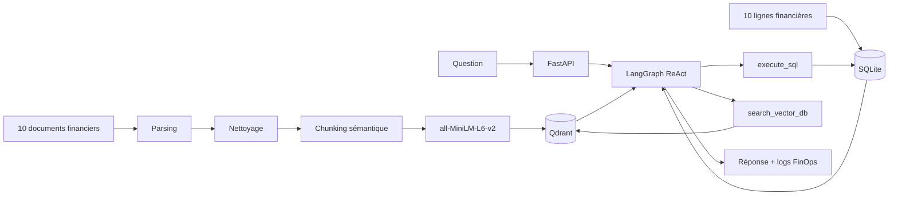

# Enterprise AI Data Analyst

Agent d'analyse financière capable de répondre à des questions à partir de
données structurées SQLite et de documents non structurés recherchés dans
Qdrant.

Le projet couvre quatre phases :

1. pipeline ETL vectoriel ;
2. agent ReAct avec LangGraph ;
3. API FastAPI déployée sur Google Cloud Run avec suivi FinOps ;
4. évaluation RAGAS manuelle et rapport d'architecture.

## Démonstration

- API Cloud Run :
  <https://enterprise-ai-analyst-1032931657035.europe-west1.run.app>
- Documentation Swagger :
  <https://enterprise-ai-analyst-1032931657035.europe-west1.run.app/docs>
- Rapport final : [REPORT.md](REPORT.md)

Exemple de question mixte :

> What was Apple's revenue in 2024, and what risks were mentioned in its Q3
> report?

L'agent interroge SQLite pour le revenu, Qdrant pour les risques du rapport,
puis Gemini synthétise les deux résultats.

## Architecture



### Composants

- **ETL** : parsing TXT/PDF, nettoyage, extraction des métadonnées et découpage
  par sections et paragraphes.
- **Embeddings** : modèle Hugging Face local `all-MiniLM-L6-v2`.
- **Vector DB** : Qdrant Docker en local ou Qdrant embarqué dans `/tmp` sur
  Cloud Run.
- **SQL** : SQLite avec la table `financials`.
- **Agent** : LangGraph ReAct avec Gemini 2.5 Flash.
- **Filtres** : extraction structurée Pydantic avec Gemini 2.5 Flash-Lite,
  normalisation des noms d'entreprise et repli heuristique.
- **API** : FastAPI avec `/`, `/health`, `/ask` et `/docs`.
- **FinOps** : tokens et coût estimé écrits dans les logs pour chaque exécution.

## Structure du projet

```text
enterprise-ai-data-analyst/
├── data/
│   ├── raw_pdfs/
│   ├── raw_txts/                 # 10 documents financiers
│   ├── cleaned/                  # sorties ETL et 137 chunks
│   ├── models/                   # modèle d'embedding local, ignoré par Git
│   ├── evaluation_results.json   # résultats des 5 tests
│   └── finance.db                # SQLite local, recréé automatiquement
├── src/
│   ├── etl/
│   │   ├── parse_documents.py
│   │   ├── clean_text.py
│   │   ├── chunking.py
│   │   ├── metadata.py
│   │   ├── ingest_qdrant.py
│   │   ├── create_finance_db.py
│   │   └── run_phase1.py
│   ├── agent/
│   │   ├── graph.py
│   │   ├── tools_sql.py
│   │   ├── tools_vector.py
│   │   └── cost_tracker.py
│   ├── api/
│   │   ├── main.py
│   │   └── start.py
│   └── evaluation/
│       └── ragas_eval.py
├── Dockerfile
├── docker-compose.yml
├── requirements.txt
├── README.md
└── REPORT.md
```

## Dataset

Le dataset comprend dix documents financiers :

| Entreprise | Document |
|---|---|
| Alphabet | Q1 2024 earnings call transcript |
| Amazon | Q2 2024 earnings release |
| Apple | Q3 2024 earnings report |
| ExxonMobil | Q2 2024 earnings report |
| Goldman Sachs | 2023 10-K risk factors |
| Meta | FY2023 annual review |
| Microsoft | FY2024 annual report |
| NVIDIA | Q1 FY2025 earnings transcript |
| Pfizer | FY2023 annual results |
| Tesla | Q4 FY2023 shareholder letter |

Chaque vecteur contient notamment :

```json
{
  "company_name": "Apple Inc.",
  "document_year": 2024,
  "document_period": "Q3",
  "document_type": "financial_report",
  "section_title": "Risk Factors Summary",
  "page": 1,
  "source": "data/raw_txts/apple_q3_2024_earnings_report.txt"
}
```

## Prérequis

- Python 3.11 ;
- Docker Desktop ;
- une clé Google Gemini ;
- Google Cloud CLI uniquement pour le déploiement Cloud Run.

## Configuration

Créez `src/.env` :

```env
GCP_API_KEY=votre_cle_gemini
```

Ne commitez jamais ce fichier. Il est exclu par `.gitignore` et
`.dockerignore`.

Variables disponibles :

| Variable | Valeur par défaut | Utilité |
|---|---|---|
| `GCP_API_KEY` | aucune | clé Gemini requise par l'agent |
| `FILTER_EXTRACTION_MODEL` | `gemini-2.5-flash-lite` | extraction des filtres |
| `QDRANT_URL` | `http://localhost:6333` | Qdrant distant/Docker |
| `QDRANT_PATH` | aucune | Qdrant local embarqué |
| `QDRANT_COLLECTION` | `finance_docs` | collection vectorielle |
| `FINANCE_DB_PATH` | `data/finance.db` | chemin SQLite |
| `EMBEDDING_MODEL_PATH` | modèle Hugging Face | modèle local |
| `PORT` | `8000` | port FastAPI |
| `FINOPS_INPUT_USD_PER_MILLION` | tarif du modèle | surcharge FinOps |
| `FINOPS_OUTPUT_USD_PER_MILLION` | tarif du modèle | surcharge FinOps |

## Installation Python

Sous PowerShell :

```powershell
python -m venv venv
.\venv\Scripts\Activate.ps1
python -m pip install --upgrade pip
pip install -r requirements.txt
```

Vérification :

```powershell
python -m pip check
python -m compileall src
```

## Phase 1 - Pipeline ETL

### Exécution complète

Démarrez Qdrant :

```powershell
docker compose up -d qdrant
```

Exécutez le pipeline et l'ingestion :

```powershell
python -m src.etl.run_phase1 --ingest
```

Cette commande :

1. recrée `data/finance.db` ;
2. parse les documents de `data/raw_txts/` ;
3. nettoie et normalise le texte ;
4. produit des chunks sémantiques ;
5. calcule les embeddings localement ;
6. crée la collection `finance_docs` dans Qdrant ;
7. insère les 137 vecteurs et leurs métadonnées.

### Exécution étape par étape

```powershell
python -m src.etl.create_finance_db --db-path data/finance.db
python -m src.etl.parse_documents `
  --input data/raw_txts `
  --output data/cleaned/parsed.jsonl
python -m src.etl.clean_text `
  --input data/cleaned/parsed.jsonl `
  --output data/cleaned/cleaned.jsonl
python -m src.etl.chunking `
  --input data/cleaned/cleaned.jsonl `
  --output data/cleaned/chunks.jsonl
python -m src.etl.ingest_qdrant
```

### Vérifier SQLite

```powershell
sqlite3 data/finance.db
```

Puis :

```sql
.tables
.schema financials
SELECT * FROM financials;
.quit
```

La table contient :

```text
company_name
year
revenue_billion_usd
net_income_billion_usd
report_type
industry
```

## Phase 2 - Agent LangGraph

L'agent possède deux outils :

- `execute_sql` : exécute uniquement des requêtes `SELECT`, retourne le schéma
  en cas d'erreur et permet une boucle de correction ;
- `search_vector_db` : extrait des filtres Pydantic stricts, normalise les
  entreprises, interroge Qdrant et relâche les filtres trop spécifiques.

Test direct :

```powershell
python -c "from src.agent.graph import run_agent; print(run_agent('What was Apple revenue in 2024 and what risks were mentioned in its Q3 report?'))"
```

## Phase 3 - API et Docker

### Lancer toute la stack

```powershell
docker compose up -d --build
docker compose ps
```

Services locaux :

- accueil : <http://localhost:8000/>
- santé : <http://localhost:8000/health>
- Swagger : <http://localhost:8000/docs>
- Qdrant : <http://localhost:6333/dashboard>

Consulter les logs :

```powershell
docker compose logs -f api
```

Arrêter :

```powershell
docker compose down
```

### Tester `/ask`

Depuis Swagger :

1. ouvrez <http://localhost:8000/docs> ;
2. sélectionnez `POST /ask` ;
3. cliquez sur **Try it out** ;
4. utilisez :

```json
{
  "question": "What was Apple's revenue in 2024, and what risks were mentioned in its Q3 report?",
  "limit": 5
}
```

5. cliquez sur **Execute**.

Depuis PowerShell :

```powershell
$body = @{
  question = "What was Apple's revenue in 2024, and what risks were mentioned in its Q3 report?"
  limit = 5
} | ConvertTo-Json

$response = Invoke-RestMethod `
  -Uri "http://localhost:8000/ask" `
  -Method Post `
  -ContentType "application/json" `
  -Body $body

$response | ConvertTo-Json -Depth 10
```

`GET /ask` retourne `405 Method Not Allowed`, car cet endpoint accepte
uniquement `POST`.

## FinOps

Chaque appel LLM écrit un enregistrement JSON dans les logs :

```text
[finops] {
  "event": "agent_loop",
  "model": "gemini-2.5-flash",
  "prompt_tokens": 2073,
  "completion_tokens": 319,
  "total_tokens": 2392,
  "estimated_cost_usd": "0.00141940"
}
```

Deux événements sont suivis :

- `metadata_filter` pour l'extraction Pydantic ;
- `agent_loop` pour la boucle LangGraph complète.

Les tokens sont ceux rapportés par Gemini. Le coût est calculé à partir des
tarifs configurés dans `src/agent/cost_tracker.py`.

## Déploiement Google Cloud Run

Déploiement actuel :

<https://enterprise-ai-analyst-1032931657035.europe-west1.run.app>

Configuration :

- projet : `de1genai-497512` ;
- région : `europe-west1` ;
- 1 vCPU et 2 GiB de RAM ;
- concurrence : 1 ;
- minimum : 0 instance ;
- maximum : 1 instance ;
- clé Gemini injectée depuis Secret Manager ;
- SQLite et Qdrant recréés dans `/tmp` au démarrage.

### Commandes de déploiement

```powershell
gcloud config set project de1genai-497512
gcloud config set run/region europe-west1

gcloud services enable `
  run.googleapis.com `
  cloudbuild.googleapis.com `
  artifactregistry.googleapis.com `
  secretmanager.googleapis.com
```

Créer le registre :

```powershell
gcloud artifacts repositories create enterprise-ai `
  --repository-format=docker `
  --location=europe-west1
```

Construire et publier :

```powershell
gcloud builds submit `
  --tag europe-west1-docker.pkg.dev/de1genai-497512/enterprise-ai/enterprise-ai-analyst:latest
```

Déployer :

```powershell
gcloud run deploy enterprise-ai-analyst `
  --image europe-west1-docker.pkg.dev/de1genai-497512/enterprise-ai/enterprise-ai-analyst:latest `
  --region europe-west1 `
  --allow-unauthenticated `
  --memory 2Gi `
  --cpu 1 `
  --concurrency 1 `
  --min-instances 0 `
  --max-instances 1 `
  --timeout 300 `
  --set-env-vars "FINANCE_DB_PATH=/tmp/finance.db,QDRANT_PATH=/tmp/qdrant,CHUNKS_PATH=/app/data/cleaned/chunks.jsonl,QDRANT_COLLECTION=finance_docs" `
  --set-secrets "GCP_API_KEY=GCP_API_KEY:latest"
```

Voir les logs cloud :

```powershell
gcloud logging read `
  'resource.type="cloud_run_revision" AND resource.labels.service_name="enterprise-ai-analyst"' `
  --limit=50
```

## Phase 4 - Évaluation

Le script exécute cinq questions couvrant :

- SQL seul ;
- recherche vectorielle seule ;
- questions mixtes SQL + documents ;
- comparaison multi-entreprises.

```powershell
python src/evaluation/ragas_eval.py `
  --api-url "https://enterprise-ai-analyst-1032931657035.europe-west1.run.app" `
  --delay-seconds 20
```

Résultats validés :

- Faithfulness moyenne : **0,96** ;
- Answer Relevance moyenne : **1,00** ;
- latence moyenne : **3,995 secondes** ;
- coût estimé : **0,1468 USD pour 100 questions similaires** avant application
  du free tier Cloud Run.

Le détail de la méthode, des notes et des coûts est dans [REPORT.md](REPORT.md).

## Questions de démonstration

```text
What was Apple's revenue in 2024, and what risks were mentioned in its Q3 report?
What was Alphabet's revenue in 2024, and what business risks were discussed in its Q1 report?
Which company has the highest net income in the SQL database?
Compare Microsoft and Meta revenue, then summarize one AI strategy from each report.
What risks were discussed in Tesla's Q4 FY2023 shareholder letter?
```

## Dépannage

### `{"detail":"Not Found"}`

Utilisez une route définie :

- `/` pour l'accueil ;
- `/health` pour la santé ;
- `/docs` pour Swagger ;
- `POST /ask` pour poser une question.

### `405 Method Not Allowed`

La route `/ask` exige une requête `POST`. Utilisez Swagger ou
`Invoke-RestMethod`.

### `GCP_API_KEY is required`

Ajoutez la clé dans `src/.env`, puis recréez le conteneur :

```powershell
docker compose up -d --no-build --force-recreate api
```

### Erreur Gemini `429`

Le quota Gemini est épuisé ou temporairement limité. Attendez le renouvellement,
activez un quota supérieur ou utilisez une autre clé autorisée.

### Aucun contexte Qdrant

Relancez l'ingestion locale :

```powershell
docker compose up -d qdrant
python -m src.etl.run_phase1 --ingest
```

### Vérifier les conteneurs

```powershell
docker compose ps
docker compose logs --tail 100 api
docker compose logs --tail 100 qdrant
```

## Sécurité

- ne jamais commiter `src/.env` ;
- stocker la clé Cloud Run dans Secret Manager ;
- révoquer immédiatement toute clé exposée ;
- limiter l'accès public si l'API est utilisée hors démonstration ;
- ne jamais journaliser les valeurs des secrets.

## Limites connues

- Qdrant est éphémère sur Cloud Run et est reconstruit à chaque nouvelle
  instance ;
- l'API conserve actuellement le dernier contexte vectoriel lors de plusieurs
  recherches dans une même boucle ;
- les quotas Gemini peuvent limiter les évaluations rapprochées ;
- les données du projet sont pédagogiques et ne remplacent pas les documents
  financiers officiels.
