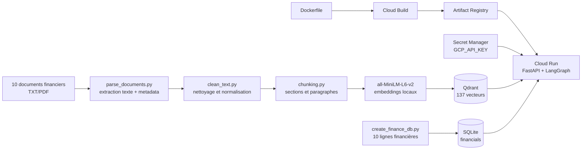
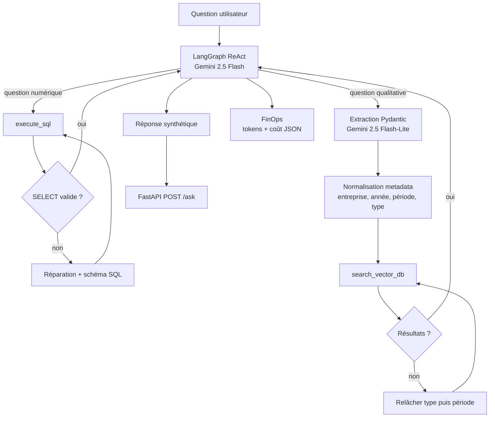

# Enterprise AI Data Analyst - Architecture Report

## 1. Résumé du système

Ce projet implémente un analyste financier agentique capable de combiner deux
types de données dans une même réponse :

- des données structurées dans SQLite, utilisées pour les calculs de chiffre
  d'affaires, bénéfice net, année, type de rapport et industrie ;
- des documents non structurés indexés dans Qdrant, utilisés pour retrouver des
  risques, stratégies et commentaires qualitatifs.

Le dataset contient dix entreprises : Alphabet, Amazon, Apple, ExxonMobil,
Goldman Sachs, Meta, Microsoft, NVIDIA, Pfizer et Tesla. L'API est déployée sur
Google Cloud Run :

`https://enterprise-ai-analyst-1032931657035.europe-west1.run.app`

La révision validée utilise 1 vCPU, 2 GiB de mémoire, une concurrence de 1,
`min-instances=0` et `max-instances=1`. Cette configuration favorise un coût
faible et évite plusieurs écritures concurrentes dans le Qdrant local.

## 2. Architecture

### Pipeline ETL et déploiement



Chaque chunk contient des métadonnées JSON strictes : `company_name`,
`document_year`, `document_period`, `document_type`, `section_title`, `page` et
`source`. Le découpage est sémantique : les titres de section et paragraphes
sont conservés avant regroupement, plutôt qu'un simple découpage tous les N
caractères.

En développement local, Docker Compose exécute Qdrant comme service séparé. Sur
Cloud Run, le conteneur est autonome : au démarrage, il recrée SQLite dans
`/tmp/finance.db` et indexe les 137 chunks dans Qdrant local sous
`/tmp/qdrant`. Cette approche évite un second service cloud payant pour une
démonstration. Sa limite est que l'index est éphémère et doit être reconstruit à
chaque nouvelle instance.

### Graphe agentique



Pour une question mixte, l'agent appelle les deux outils. Par exemple, l'année
2024 est appliquée à SQLite, tandis que `Q3` est appliqué uniquement aux
documents. L'outil SQL refuse toute commande autre que `SELECT` et renvoie le
schéma lors d'une erreur. L'outil vectoriel normalise les alias, par exemple
`Alphabet` vers `Alphabet Inc.`, afin que les filtres correspondent exactement
aux valeurs Qdrant.

## 3. Évaluation RAGAS manuelle

Le script [`src/evaluation/ragas_eval.py`](src/evaluation/ragas_eval.py) envoie
cinq questions à l'endpoint Cloud Run. Les sorties consolidées sont conservées
dans [`data/evaluation_results.json`](data/evaluation_results.json).

La notation suit une échelle de 0 à 1 :

- **Faithfulness** : chaque affirmation doit être supportée par le résultat SQL
  ou les passages récupérés ;
- **Answer Relevance** : la réponse doit traiter directement toutes les parties
  de la question sans contenu inutile.

| Test | Type | Faithfulness | Relevance | Latence |
|---|---|---:|---:|---:|
| Apple revenu + risques Q3 | Mixte | 1,0 | 1,0 | 4,088 s |
| Alphabet revenu + risques Q1 | Mixte | 1,0 | 1,0 | 5,547 s |
| Plus grand bénéfice net | SQL | 1,0 | 1,0 | 1,451 s |
| Microsoft vs Meta + stratégies IA | Mixte multi-document | 0,8 | 1,0 | 5,120 s |
| Risques Tesla FY2023 | Vectoriel | 1,0 | 1,0 | 3,768 s |
| **Moyenne** | | **0,96** | **1,00** | **3,995 s** |

Les réponses Apple, Alphabet, Microsoft et Tesla reprennent correctement les
faits présents dans les sources. La requête SQL identifie Microsoft comme ayant
le bénéfice net maximal, à 88,1 milliards USD.

Le score de fidélité Microsoft/Meta est réduit à 0,8. L'agent a effectué deux
recherches vectorielles, mais l'objet final de l'API ne conserve actuellement
que le dernier `ToolMessage` vectoriel. La réponse est cohérente avec les
documents, mais la preuve Microsoft n'est pas entièrement visible dans le
payload final. Une amélioration serait d'accumuler tous les contextes plutôt que
de remplacer la liste à chaque appel d'outil.

Un autre risque opérationnel a été observé : après plusieurs séries rapprochées,
Gemini a renvoyé des erreurs de quota. Le script effectue jusqu'à trois essais
espacés, mais un quota journalier ne peut pas être corrigé par un simple retry.
Les notes ci-dessus proviennent des cinq exécutions réussies obtenues en deux
lots. Cette limite affecte la disponibilité, pas la fidélité des réponses
réussies.

Commande de reproduction :

```powershell
python src/evaluation/ragas_eval.py `
  --api-url "https://enterprise-ai-analyst-1032931657035.europe-west1.run.app" `
  --delay-seconds 20
```

## 4. Analyse des coûts

### Mesures observées

Cloud Logging produit une ligne `[finops]` pour l'extraction des filtres et une
ligne pour chaque boucle agentique. Les cinq réponses réussies ont consommé
environ **0,006758 USD** de Gemini, soit :

- coût moyen LLM par question : **0,001352 USD** ;
- coût Gemini projeté pour 100 questions similaires : **0,1352 USD**.

Le calcul utilise les tokens réellement rapportés par Gemini et les tarifs
configurés : Gemini 2.5 Flash à 0,30 USD/M tokens d'entrée et 2,50 USD/M tokens
de sortie ; Flash-Lite à 0,10 USD/M en entrée et 0,40 USD/M en sortie.

Pour Cloud Run, 100 requêtes à la latence moyenne observée représentent environ
399,5 secondes actives avec 1 vCPU et 2 GiB. Avant free tier :

`CPU = 399,5 x 0,000024 = 0,00959 USD`

`RAM = 399,5 x 2 x 0,0000025 = 0,00200 USD`

Le coût Cloud Run théorique est donc **0,0116 USD pour 100 requêtes**, hors
cold starts. Avec le free tier mensuel de Cloud Run, ce faible volume devrait
être facturé **0 USD**.

Le déploiement a utilisé deux builds, un échoué et un réussi, pour environ
5,21 minutes au total. Cette consommation reste dans le quota gratuit de Cloud
Build. L'image Artifact Registry mesure 713 017 113 octets, soit environ
0,713 Go. Les premiers 0,5 Go sont gratuits ; la partie excédentaire représente
environ **0,021 USD/mois** si l'image est conservée.

| Poste | Consommation observée/projetée | Coût estimé |
|---|---:|---:|
| Gemini, 5 tests réussis | tokens mesurés dans Cloud Logging | 0,006758 USD |
| Gemini, 100 questions | extrapolation du mix de tests | 0,1352 USD |
| Cloud Run, 100 questions | 399,5 vCPU-s + 799 GiB-s | 0,0116 USD avant free tier |
| Cloud Build | 5,21 minutes | 0 USD dans le quota gratuit |
| Artifact Registry | image de 0,713 Go | environ 0,021 USD/mois |
| **Total variable / 100 questions** | Gemini + Cloud Run | **environ 0,1468 USD** avant free tier |

Les crédits GCP consommés visibles pour cette petite démonstration sont donc
effectivement proches de **0 USD pour l'infrastructure**, car Cloud Run et Cloud
Build restent dans leurs quotas gratuits. La charge principale par requête est
Gemini. La facturation GCP définitive peut apparaître avec plusieurs heures de
retard ; les valeurs ci-dessus sont une estimation FinOps reproductible, pas une
facture.

Sources tarifaires consultées le 13 juin 2026 :

- [Cloud Run pricing](https://cloud.google.com/run/pricing)
- [Cloud Build pricing](https://cloud.google.com/build/pricing)
- [Artifact Registry pricing](https://cloud.google.com/artifact-registry/pricing)
- [Gemini API pricing](https://ai.google.dev/gemini-api/docs/pricing)

## 5. Conclusion

Le système satisfait les quatre phases : ETL vectoriel, agent LangGraph avec
outils SQL et Qdrant, déploiement Cloud Run avec FinOps, puis évaluation sur cinq
questions. Les résultats montrent une bonne qualité moyenne
(`Faithfulness=0,96`, `Answer Relevance=1,00`) pour un coût variable inférieur à
0,15 USD par 100 questions similaires. Les améliorations prioritaires sont
l'accumulation de tous les contextes multi-outils, la réduction de la taille de
l'image Docker et l'utilisation d'un quota Gemini adapté à une charge soutenue.
