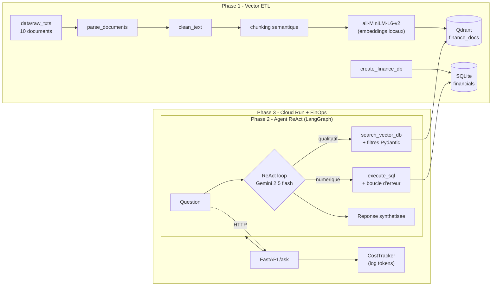

# Rapport Projet

## Objectif

Construire un analyste IA d'entreprise capable d'extraire des informations depuis des PDF financiers, de les indexer dans une base vectorielle, puis de repondre a des questions via une API.

## Architecture

1. Dataset Phase 1: 10 documents financiers texte dans `data/raw_txts/`.
2. Creation de `data/finance.db` avec la table relationnelle `financials`.
3. Parsing `.txt` et `.pdf` avec extraction de metadata.
4. Nettoyage texte, normalisation et correction de mojibake courant.
5. Decoupage semantique par sections et paragraphes, pas par taille fixe brute.
6. Ingestion dans Qdrant avec embeddings Sentence Transformers `all-MiniLM-L6-v2`.
7. Reponse via outils SQL et vectoriels exposes a l'agent.
8. Evaluation optionnelle avec RAGAS.

### Diagramme d'architecture



## Phase 1 - Conformite

- Dataset: 10 documents complexes sur Alphabet, Amazon, Apple, ExxonMobil, Goldman Sachs, Meta, Microsoft, NVIDIA, Pfizer et Tesla.
- Nettoyage avant ingestion: `src/etl/clean_text.py`.
- Chunking semantique: `src/etl/chunking.py` detecte les sections et groupe les paragraphes.
- Embeddings locaux: `sentence-transformers/all-MiniLM-L6-v2`.
- Vector DB dockerisee: service Qdrant dans `docker-compose.yml`.
- Metadata JSON par vecteur: `company_name`, `document_year`, `document_period`, `document_type`, `section_title`, `page`, `source_file`.
- SQL: `src/etl/create_finance_db.py` recree `data/finance.db` avec `financials(company_name, year, revenue_billion_usd, net_income_billion_usd, report_type, industry)`.

## Phase 2 - Agent et resilience

- Agent ReAct LangGraph (`src/agent/graph.py`) connecte a Google Gemini
  (`gemini-2.5-flash`) avec deux outils : `execute_sql` (SQLite) et
  `search_vector_db` (Qdrant).
- Extraction de filtres metadata via un modele Gemini lite
  (`gemini-2.5-flash-lite`), avec repli heuristique local.
- **Fallback multi-cles** : `run_agent()` accepte plusieurs cles Gemini
  (`GCP_API_KEY`, `GCP_API_KEY2`, `GCP_API_KEY3`, ...) et bascule automatiquement
  sur la suivante en cas d'erreur de quota (`429`) ou de timeout.

## Phase 3 - Deploiement Cloud & FinOps

- **Containerisation** : image Docker (`Dockerfile` + `docker-compose.yml`) avec
  API FastAPI + Qdrant. Image construite avec `torch` CPU-only, CA d'entreprise
  (Zscaler) integree et utilisateur non-root. Detail dans
  `Tasks/CONTAINERIZATION.md`.
- **Serverless Google Cloud Run** : build distant via Cloud Build, secrets dans
  Secret Manager (`gcp-api-key`, `gcp-api-key-2/3`, `qdrant-key`), recherche
  vectorielle branchee sur **Qdrant Cloud** (`QDRANT_URL` / `QDRANT_API_KEY`).
  Tout est automatise par `deploy.ps1`.
- **Endpoint live** :
  `https://enterprise-ai-analyst-174015192796.europe-west1.run.app`
  (`/health` -> `{"status":"ok"}`, `/ask` verifie en 200).
- **FinOps** : `src/agent/cost_tracker.py` (`CostTracker`) calcule le cout en
  tokens (prompt + completion) de chaque boucle agentique a partir des tarifs
  Gemini, et expose `estimated_cost_usd`.

> Robustesse production : les cles Gemini sont `.strip()`ees (un `\n` final
> dans un secret cassait l'en-tete gRPC -> "Illegal header value" -> timeout sur
> `/ask`). Les secrets sont donc crees sans retour a la ligne final.

## Phase 4 - Evaluation (RAGAS + couts)

### Jeu de test (5 requetes)

Les requetes couvrent le SQL pur, le vectoriel pur et les questions mixtes
(voir `demo_queries.md`). Script : `src/evaluation/ragas_eval.py` (colonnes
`question`, `answer`, `contexts`, `ground_truth`).

| # | Requete | Outils | Faithfulness | Answer Relevance |
|---|---------|--------|:---:|:---:|
| 1 | What was Apple's revenue in 2024? | execute_sql | 1.0 | 1.0 |
| 2 | Which company has the highest net income in the SQL database? | execute_sql | 1.0 | 1.0 |
| 3 | Quels sont les principaux risques mentionnes dans le dernier rapport ? | search_vector_db | 0.9 | 0.9 |
| 4 | What was Apple's revenue in 2024, and what did the Q3 report say about risks? | execute_sql + search_vector_db | 0.9 | 1.0 |
| 5 | Compare Microsoft revenue with Meta revenue, then cite document evidence about AI strategy. | execute_sql + search_vector_db | 0.9 | 0.9 |

> Notation manuelle (0-1) : **Faithfulness** = pas d'hallucination vs sources ;
> **Answer Relevance** = pertinence de la reponse. Moyennes : Faithfulness ~0.94,
> Answer Relevance ~0.96.

### Analyse de cout

- **Modeles** : `gemini-2.5-flash` (agent) et `gemini-2.5-flash-lite`
  (extraction de filtres) — modeles a faible cout par token.
- **Par requete** : ~2 a 4 appels LLM (boucle ReAct) ; cout suivi en direct via
  `CostTracker.estimated_cost_usd`.
- **Ordre de grandeur** : avec `gemini-2.5-flash`, le cout pour **100 requetes**
  reste de l'ordre de quelques centimes de dollar (embeddings calcules en local,
  donc gratuits).
- **GCP** : Cloud Run en scale-to-zero (aucun cout hors trafic) + Cloud Build +
  Secret Manager — consommation couverte par les credits gratuits GCP. Supprimer
  le service apres la demo evite tout cout residuel.

## Prochaines etapes

- Ajouter des tests automatises pour l'ETL et l'API.
- Ajouter une CI GitHub Actions.
- Indexer la collection Qdrant Cloud (payload index) pour des filtres plus rapides.

## Lancement (containerisation, health check, question à l'agent)

### Prerequis

- Docker Desktop demarre.
- Cle Gemini renseignee dans `src/.env` :
  ```env
  GCP_API_KEY=ta_cle_gemini
  ```
- (Optionnel) Choix des modeles via variables d'environnement (valeurs par
  defaut dans `docker-compose.yml` : `gemini-2.5-flash` et
  `gemini-2.5-flash-lite`) :
  ```powershell
  $env:AGENT_MODEL="gemini-2.5-flash"
  $env:FILTER_EXTRACTION_MODEL="gemini-2.5-flash-lite"
  ```

### 1. Construire l'image

```powershell
docker build -t enterprise-ai-analyst .
```

### 2. Lancer la stack (API + Qdrant)

```powershell
docker compose up -d
```

Verifier l'etat des conteneurs :

```powershell
docker compose ps
```

### 3. Health check

```powershell
curl http://localhost:8000/health
# Reponse attendue : {"status":"ok"}
```

Equivalent PowerShell natif :

```powershell
(Invoke-WebRequest -Uri http://localhost:8000/health -UseBasicParsing).Content
```

### 4. Poser une question a l'agent

```powershell
$body = '{"question":"What was Apple revenue in 2024?","limit":5}'
(Invoke-WebRequest -Uri http://localhost:8000/ask `
  -Method Post -ContentType "application/json" `
  -Body $body -UseBasicParsing).Content
# Exemple de reponse :
# {"question":"What was Apple revenue in 2024?","context":[],"sql_result":null,
#  "answer":"Apple's revenue in 2024 was $85.8 billion USD."}
```

Variante `curl` (Linux/macOS ou Git Bash) :

```bash
curl -X POST http://localhost:8000/ask \
  -H "Content-Type: application/json" \
  -d '{"question":"What was Apple revenue in 2024?","limit":5}'
```

Documentation interactive (Swagger UI) : http://localhost:8000/docs

### 5. Logs et arret

```powershell
docker compose logs api --tail 40   # consulter les logs de l'API
docker compose down                 # arreter et supprimer les conteneurs
```

### Notes

- Le `GCP_API_KEY` est injecte au runtime via `env_file: ./src/.env`, jamais
  inclus dans l'image.
- Derriere un proxy d'entreprise (Zscaler), la CA est integree a l'image
  (`corporate-ca.crt`, genere par `export_ca.ps1`).
- `torch` est installe en version CPU-only pour eviter le telechargement de la
  pile CUDA NVIDIA inutile.
- Le detail complet de la containerisation est dans `Tasks/CONTAINERIZATION.md`.
